# [fit] Introduction

<!--  -->
<!--  -->

^ Привет всем. Собираюсь рассказать вам о классах и операциях библиотеки ReactiveCocoa.

^ Будет сухая, но полезная теория.

^ Сталкивался с ситуациями когда у тебя сильное желание использовать ReactiveCocoa и ты его используешь, но не понимаешь как его использовать правильно. Как итог ты оказываешься тем самым строителем, который крепит подоконник на уровне колен.

^ Я считаючто нужно хорошо понимать основы ReactiveCocoa, иначе вы только усложните себе жизнь исопльзуя ReactiveCocoa.

---
## **Ilya Laryionau**
### @larryonoff

^ Совсем немного обо мне. Меня зовет Илья Ларионов.

^ На данный момент работаю Team Lead / Senior Developer.

---
# Components

^ ReactiveCocoa состоит из нескольких компонент.

^ Я разделил компоненты в две группы: основные и дополнительные.

---

- Events
- Observers
- Disposables

- Signals
- Signal Producers
- Schedulers

^ Эти компоненты я выделил в основную группу. С нимы вы будете чаще всего иметь дело.

---
# Events

Representation of the fact that something has happened

^ Название говорит само за себя.
^ Event это неотьемлимая часть сигналов / стримов.

---
# Events

```swift
enum Event<Value, Error: ErrorType> {
	case Next(Value)
	case Failed(Error)
	case Completed
	case Interrupted
}
```

^ 4 вида событий.

^ Next - новое значение из источника
^ Failed - произошла ошибка до окончания сигнала
^ Completed - сигнал был успешно выполнен
^ Interrupted - сигнал был отменен / прерван, ни успешно, ни безуспешно

---
# Observers

An observer is anything that is waiting or capable of waiting for events

^ Within RAC, an observer is represented as an Observer that accepts Event values.

---
# Observers

```swift
struct Observer<Value, Error: ErrorType> {
	func sendNext(value: Value)
	func sendFailed(error: Error)
	func sendCompleted()
	func sendInterrupted()
}
```

^ по сути wrapper

---
# Disposables

A disposable is a mechanism for memory management and cancellation.

^ когда вы запускаете signal producer, вам возвращают Disposable.
^ В зависимости от той работы которую выполняет сигнал вы можете отменить запрос
^ или очистить временные ресурсы

---
# Disposables represented by

- SimpleDisposable
- ActionDisposable
- CompositeDisposable
- ScopedDisposable
- SerialDisposable

^ в rac всего 5 типов Disposable

---
## SimpleDisposable

A disposable that only flips _disposed_ upon disposal, and performs no other work

^ Я ни разу не использовал. Из того что я нашел это внутри RAC.

---
## ActionDisposable

A disposable that will run an action upon disposal

^ Например NSNotificationCenter

---
## CompositeDisposable

A disposable that will dispose of any number of other disposables

^ Один из самых часто исопльзуемых Disposable. Например если у вас из ViewModel выставлено в наружу несоклько свойст или сигналов (username, lastName, firstName) и во View вы подписываетесь на них. А в какой то момент вам необходимо отключить слежение за изменениями этих свойст, то вам достаточно сделать dispose у одного Disposable, а не у каждого.

^ Я часто использую CompositeDisposable вместе с ScopedDisposable

---
## ScopedDisposable

A disposable that, upon deinitialization, will automatically dispose of another disposable

---
## SerialDisposable

A disposable that will optionally dispose of another disposable

`innerDisposable`

^ innerDisposable
^ Например автоподсказка в строке поиска.

---
# Signals

^ Hot

A signal is series of events over time that can be observed

^ Signals are generally used to represent event streams that are already “in progress”, like notifications, user input, etc

^ Signals can be manipulated by applying primitives to them.

^ Жизненный цикл сигнала состоит из последовательности .Next событий
^ которые предшествуют событиям завершающим событиям: .Completed, .Failed, .Interrupted

---
# Signals

observe*

```swift
final class Signal<Value, Error: ErrorType> {
  func observeNext(next: Value -> ()) -> Disposable?
  func observeCompleted(completed: () -> ()) -> Disposable?
  func observeFailed(error: Error -> ()) -> Disposable?
  func observeInterrupted(interrupted: () -> ()) -> Disposable?
}
```

^ Как я говорил выше, мы можем подписаться на события сигнала, с помощью следующих методов

^ Обратите внимание на то что каждый из этих методов возвращает Disposable
^ т.е. мы в любой момент отписаться от событий

---
# Pipes

A signal that can be manually controlled

^ один из способов создания Signal

---
# Pipes

```swift
final class Signal<Value, Error: ErrorType> {
  static func pipe() -> (Signal, Observer)
}
```

^ сама конструкция выглядит вот так

^ The method returns a signal and an observer. The signal can be controlled by sending events to the observer. This can be extremely useful for bridging non-RAC code into the world of signals.

---
# Pipes

```swift
let (signal, observer) = Signal<Int, NoError>.pipe()

signal.observeNext { intValue in print("\(intValue)") }

observer.sendNext(1) // 1
observer.sendNext(2) // 2
observer.sendNext(3) // 3

observer.sendCompleted()

```

---
# Signal Producers

A signal producer is any series of events over time that can be observed, but has to be started

^ Cold

^ последовательность событий на которые мы можем подписаться, но нам необходимо запустить эту последовательность
^ каждый запуск последовательности, будет создавать новую операцию, на события которой мы можем подписаться
^ можем использоваться для представления сетевых запросов, операций поучения данных из базы данных и т.д.

^ Just like signals, signal producers can also be manipulated via primitives.

---
# Signal Producers

```swift
struct SignalProducer<Value, Error: ErrorType> {
  init<S: SignalType where S.Value == Value, S.Error == Error>(signal: S)
  init(_ startHandler: (Signal<Value, Error>.Observer, CompositeDisposable) -> ())
  init(value: Value)
  init(error: Error)
  init<S: SequenceType where S.Generator.Element == Value>(values: S)
}
```

^ завернуть Signal в SignalProducer
^ завернуть какую то логику в SignalProducer
^ завернуть значение, ошибку, массив

---
# Signal Producers

```swift
let oneProducer = SignalProducer<Int, NoError>(value: 1)

// .Next(1)
// .Completed
```

---
# Signal Producers

```swift
let oneTwoThreeProducer = SignalProducer<Int, NoError>(values: [1, 2, 3])

// .Next(1)
// .Next(2)
// .Next(3)
// .Completed
```

^ Итого мы получим 4 события: 3 next и 1 completed

---
# Signal Producers

```swift
extension NSNotificationCenter {
	func rac_notifications(name: String, object: AnyObject? = nil) -> SignalProducer<NSNotification, NoError> {
		return SignalProducer { observer, disposable in
			let notificationObserver = self.addObserverForName(name, object: object, queue: nil) { notification in
				observer.sendNext(notification)
			}

			disposable.addDisposable {
				self.removeObserver(notificationObserver)
			}
		}
	}
}

```

---
# Signal Producers

startWith*

```swift
struct SignalProducer<Value, Error: ErrorType> {
  func startWithNext(next: Value -> ()) -> Disposable
  func startWithCompleted(completed: () -> ()) -> Disposable
  func startWithFailed(failed: Error -> ()) -> Disposable
  func startWithInterrupted(interrupted: () -> ()) -> Disposable
}
```

^ как видите в отличии от Signal.observe* -> SignalProducer.startWith*

---
# Signal Producers

```swift
let oneTwoThreeProducer = SignalProducer<Int, NoError>(values: [1, 2, 3])
oneTwoThreeProducer.startWithNext { intValue in
	print("\(intValue)")
}
```

---
# Buffers

Queue for events that replays those events when new signals are created from the producer.

---
# Buffers

```swift
struct SignalProducer<Value, Error: ErrorType> {
  static func buffer(capacity: Int) ->
    (SignalProducer, Signal<Value, Error>.Observer)
}
```

---
# Schedulers

A scheduler is a serial execution queue to perform work or deliver results upon.

^ серийная очередь для выполнения определенных действий или очередь доставки результатов
^ Близки к GCD, но поддерживают отмену
^ выполняют свои действия последовательно
^ за исключением ImmediateScheduler, не поддерживают синхронное выполнение

^ Schedulers are similar to Grand Central Dispatch queues, but schedulers support cancellation (via disposables), and always execute serially. With the exception of the ImmediateScheduler, schedulers do not offer synchronous execution.

---
# Schedulers represented by

- ImmediateScheduler
- UIScheduler
- QueueScheduler
- TestScheduler

---
## ImmediateScheduler

A scheduler that performs all work synchronously

---
## UIScheduler

A scheduler that performs all work on the main thread

---
## QueueScheduler

A scheduler backed by a serial GCD queue

---
## TestScheduler

A scheduler that implements virtualized time, for use in testing

---

- Properties
- Actions

---
# Properties

A property stores a value and notifies observers about future changes to that value

---
# Properties

```swift
protocol PropertyType {
	associatedtype Value

	var value: Value { get }

	var producer: SignalProducer<Value, NoError> { get }
	var signal: Signal<Value, NoError> { get }
}
```

---

# Properties represented by

- AnyProperty
- ConstantProperty
- MutableProperty
- ~~DynamicProperty~~

---
## AnyProperty

A read-only property that allows observation of its changes

---
## ConstantProperty

A property that never changes

---
## MutableProperty

A mutable property that allows observation of its changes

---
## ~~DynamicProperty~~

Wraps a _dynamic_ property, or one defined in Objective-C, using Key-Value Coding and Key-Value Observing

---
# Actions

Signal Producer wrapper that provides convenient API for
- its signal producer execution state
- signal producer values and errors

---
# Actions represented by

- Action
- ~~CocoaAction~~

^ CocoaAction Wraps an Action for use by a GUI control (such as _NSControl_ or _UIControl_), with KVO, or with Cocoa Bindings

---
# Actions

```swift
class Action<Input, Output, Error: ErrorType> {
  var values: Signal<Output, NoError>
  var errors: Signal<Error, NoError>
  var executing: AnyProperty<Bool>
}
```

---
# Actions

```swift
class Action<Input, Output, Error: ErrorType> {
  init(_ execute: Input -> SignalProducer<Output, Error>)

  func apply(input: Input) -> SignalProducer<Output, ActionError<Error>>
}
```

---
# ~~CocoaAction~~

CocoaAction Wraps an Action for use by a GUI control (such as _NSControl_ or _UIControl_), with KVO, or with Cocoa Bindings

---
# Operators

---
# Operators

- Transforming
- Flattening
- Aggregating
- Combining
- Filtering
- Failures

---
# Transforming Operators

---
## map

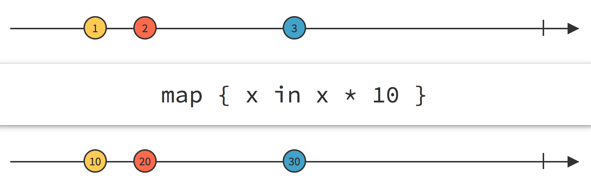

---
## delay

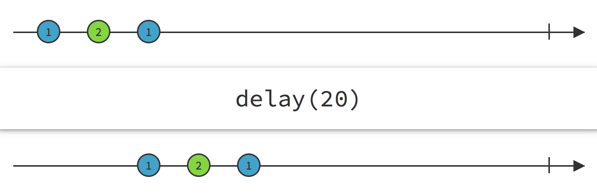

---
# Flattening Operators

---
## flatten(.Merge)

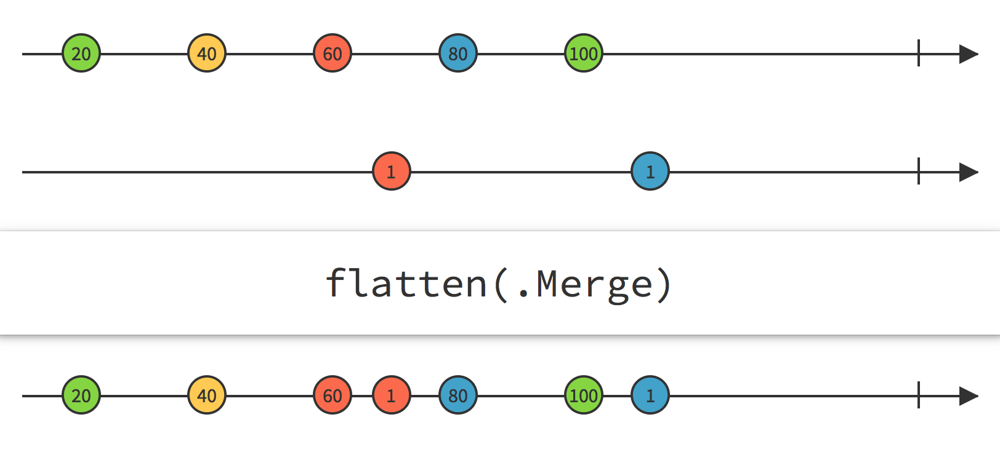

---
## flatten(.Concat)

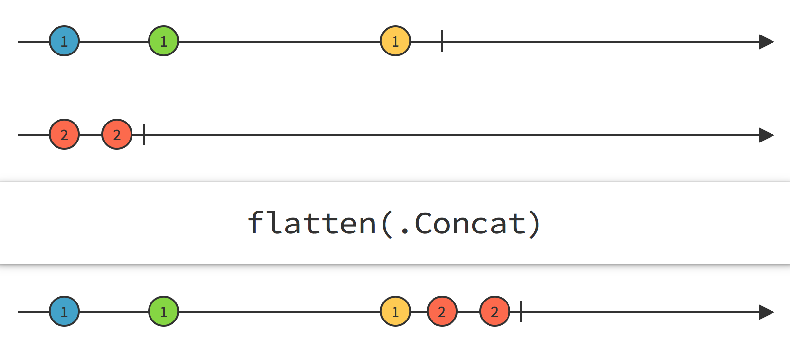

---
# Aggregating Operators

---
## reduce

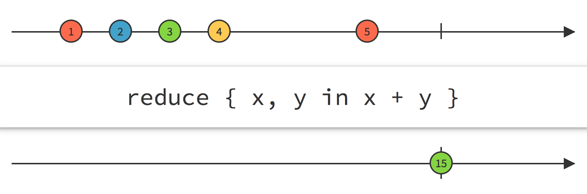

---
## scan

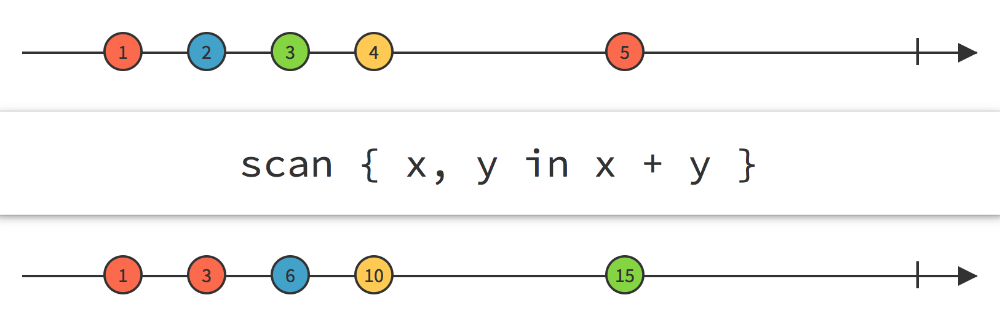

---
# Combining Operators

---
## combineLatest

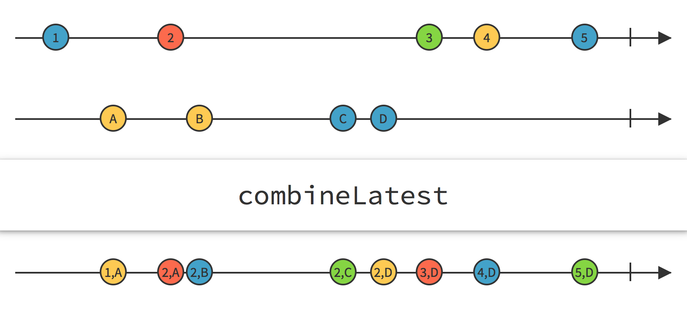

---
## zip

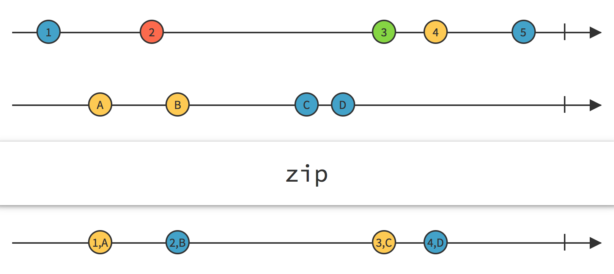

---
### sample

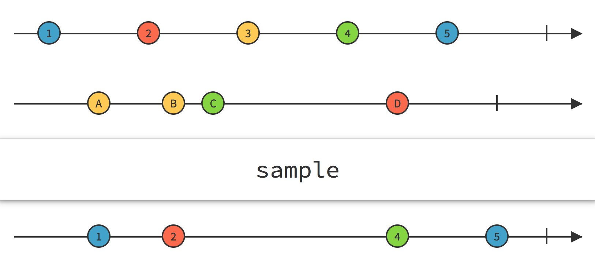

---
# Filtering Operators

---
## filter

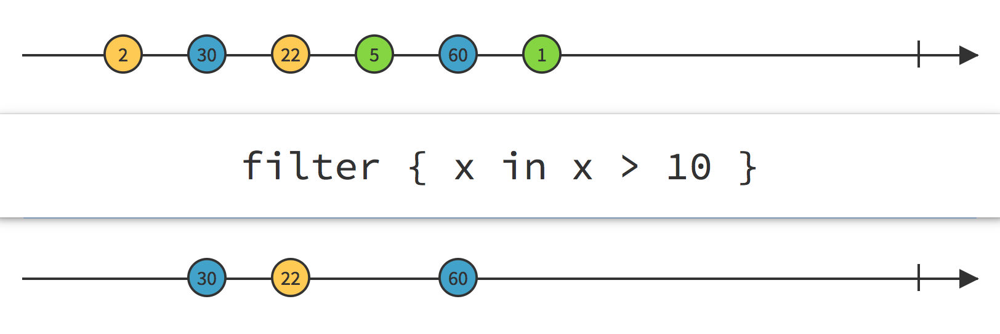

---
## skip

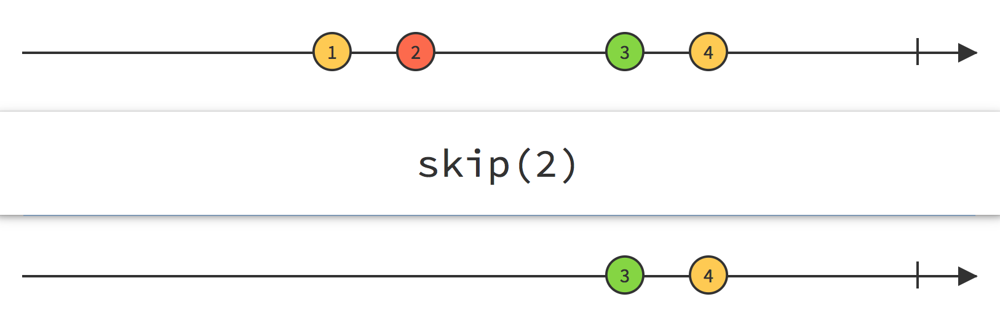

---
## skipRepeats

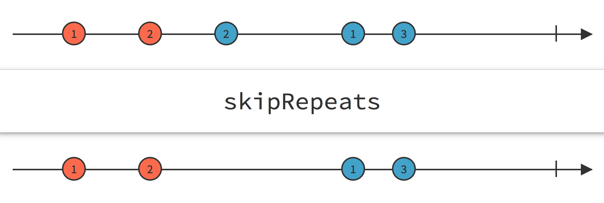

---
## throttle

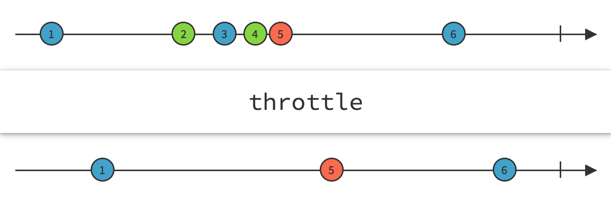

---
# Failures Operators

---
## flatMapError

```swift
func flatMapError<F>(handler: Error -> SignalProducer<Value, F>) ->
  SignalProducer<Value, F>
```

---
## retry

```swift
func retry(count: Int) ->
  SignalProducer<Value, Error>
```

---
# Example

```swift
let searchResults = searchStrings
    .flatMap(.Latest) { (query: String) -> SignalProducer<(NSData, NSURLResponse), NSError> in
        let URLRequest = self.searchRequestWithEscapedQuery(query)

        return NSURLSession.sharedSession()
            .rac_dataWithRequest(URLRequest)
            .retry(2)
            .flatMapError { error in
                print("Network error occurred: \(error)")
                return SignalProducer.empty
            }
    }
    .map { (data, URLResponse) -> String in
        let string = String(data: data, encoding: NSUTF8StringEncoding)!
        return self.parseJSONResultsFromString(string)
    }
    .observeOn(UIScheduler())
```

---
# Official Documentation

- [Basic operators](https://github.com/ReactiveCocoa/ReactiveCocoa/blob/master/Documentation/BasicOperators.md)
- [Framework Overview](https://github.com/ReactiveCocoa/ReactiveCocoa/blob/master/Documentation/FrameworkOverview.md)

# References

- [neilpa.me/rac-marbles](http://neilpa.me/rac-marbles)
- [rxmarbles.com](http://rxmarbles.com)

---
# End


^ да прибует с вами stream

---
# Questions?
